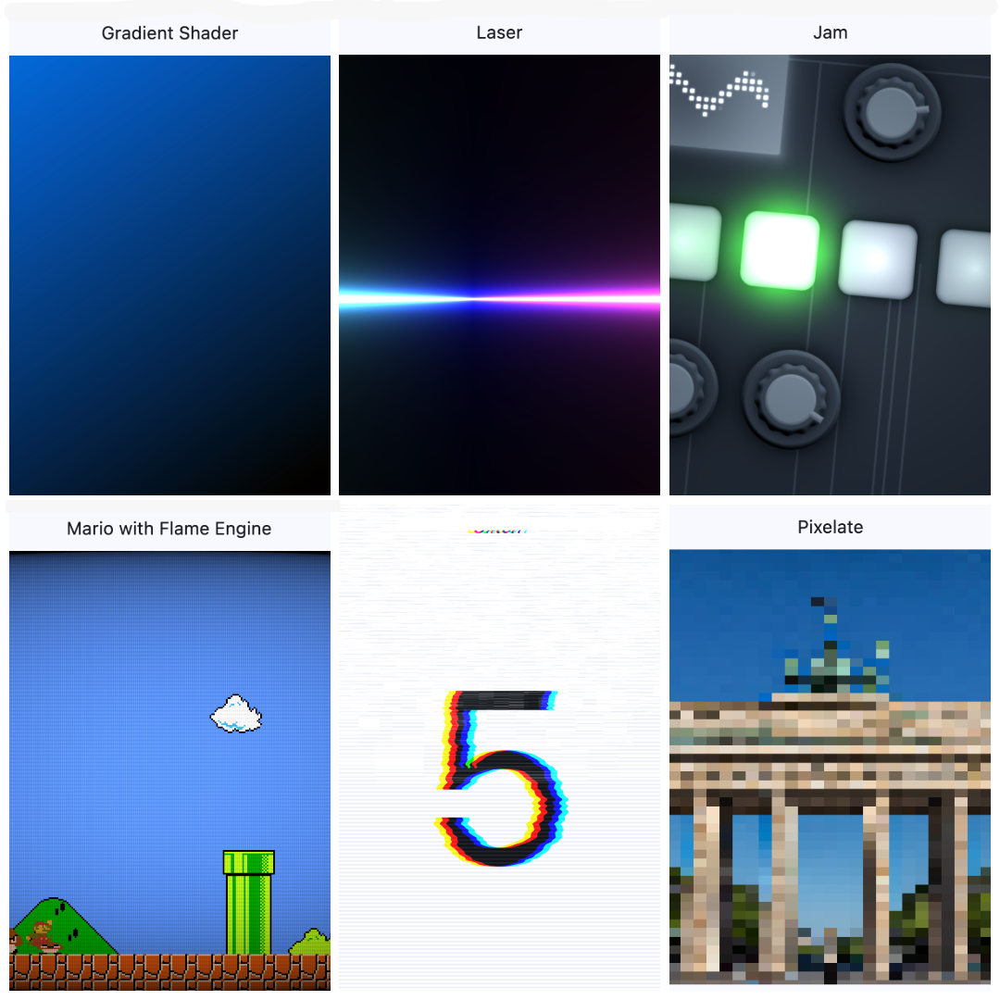

# Flutter Shader Examples

I collected a few examples for shaders in Flutter. Most code is written by others and rewritten / updated by me. Original sources are referenced below. Some examples below show the same shader in [Flutter](https://flutter.dev/) and in [Flame engine](https://flame-engine.org/). The goal is to demonstrate a number different techniques to integrate custom shaders in your Flutter/Flame app.

To run the demo app, you need [Flutter installed](https://docs.flutter.dev/get-started/install). Unzip and add a platform, e.g. `flutter create --platforms=macos .` , then `flutter run`.

1. solid: solid color
1. gradient: color gradient, FlutterFragCoord().xy
1. animated_gradient: ShaderMask / RadialGradient, derived from https://api.flutter.dev/flutter/widgets/ShaderMask-class.html and https://stackoverflow.com/questions/76496575/animate-linear-gradient-background-of-container-in-flutter
1. laser: converted from https://www.shadertoy.com/view/4f2GRR 
1. water: https://www.shadertoy.com/view/Ms2SD1, adapted from https://github.com/wolfenrain/flutter_shaders_example/ (Performance problems)
1. jam: https://www.shadertoy.com/view/ldfSW2, adapted from https://github.com/wolfenrain/flutter_shaders_example/ 
1. stars: interactive, https://www.shadertoy.com/view/XlfGRj, adapted from https://github.com/wolfenrain/flutter_shaders_example/ (Performance problems, wrong direction)
1. stars_flame: flame engine, interactive, https://www.shadertoy.com/view/XlfGRj (Performance problems)
1. mario_flame: flame engine https://www.shadertoy.com/view/XtlSD7 
1. snow: timer, flutter_shaders, texture sampler, https://www.shadertoy.com/view/XlSBz1, adapted from https://github.com/wolfenrain/flutter_shaders_example/ (Performance problems)
1. glitch: flutter_shaders, texture sampler (the whole interactive app window is glitched), adapted from https://github.com/wolfenrain/flutter_shaders_example/
1. pixelate: flutter_shaders, texture sampler from https://github.com/jonahwilliams/flutter_shaders/
1. lava_flame: flame engine, [Hexler KodeLife](https://hexler.net/kodelife) start example
1. barrel_blur: flutter_shaders, interactive, adapted from: https://github.com/renancaraujo/shaders_playground 
1. overscroll: flutter_shaders, interactive, adapted from: https://github.com/renancaraujo/shaders_playground 

## open issues

* Rewrite snow, which does not need an Animated Sampler 
* tested on macOS, needs tests on other platforms
* NEW (0.3.0) compiles on Android (tested on Samsung Galaxy A26 5G). some shaders need screen size fixes. 

## resources

https://docs.flutter.dev/ui/design/graphics/fragment-shaders    
https://github.com/flutter/engine/blob/main/impeller/docs/shader_optimization.md  

https://pub.dev/packages/flutter_shaders helpers and texture samplers    

https://blog.codemagic.io/shady-flutter/    
https://github.com/wolfenrain/flutter_shaders_example     

